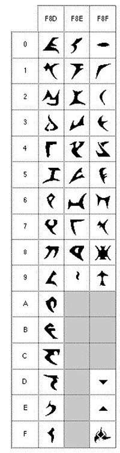

[](https://coveralls.io/github/darwinsimon/klingon-project?branch=master)

# Klingon Project

This application will translate any character written in English to Klingon. If the give name is a valid Star Trek character, it will show the species information.
The Klingon translation will use unicode as representative. Species information is provided by http://stapi.co

Valid species information will be stored in `char.txt` to reduce API calls for the same character.

## How To Use

### Build
- Install Go. Downloads and instructions are available [here](https://golang.org/dl/).
- Run `go get` and `go build` in repository main folder

### Run
Run the application with character's name as parameter
```bash
./klingon-project Uhura

Processing...

Klingon Name   : 0xF8E5 0xF8D6 0xF8E5 0xF8E1 0xF8D0
Species        : Human
```

## Restrictions
- Translation will fail if the name consists any unavailable characters (c, g, k, x, z, etc.)
- All characters are treated as case-insensitive, except for Q
- If Star Trek API returns more than 10 results, species will treated as inconclusive.
- Space will use unicode `0x0020`

### Klingon Text


### Klingon Unicode
